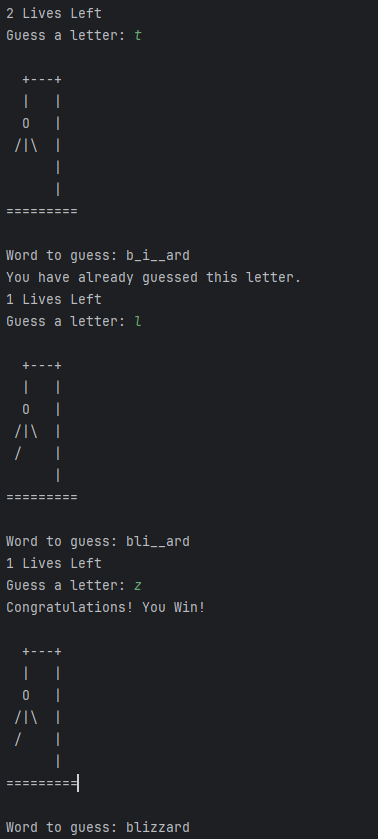

# Day 007

## Hangman
A word-guessing game where the player tries to reveal the hidden word one letter at a time.
Built to practice lists, loops, conditionals, and managing game state.
This was tougher than I anticipated. The step of wrapping the code in a while loop to keep asking for inputs was the hardest
as I kept forgetting to keep the guess display in the loop so everything the program did kept adding to the display.
Once I figured that out, making the lives system was like ten times easier.

