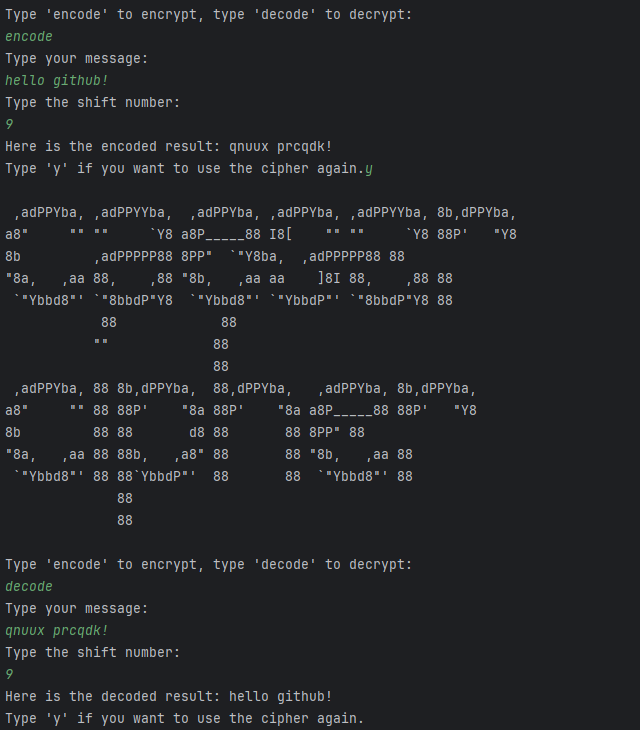
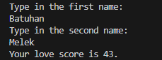

# Day 008

## Caesar Cipher
A program that encodes and decodes text using the Caesar Cipher technique.
Built to practice functions, parameters, loops, and string manipulation.

[Click here to run the program](https://www.programiz.com/online-compiler/7gyAftVypumqp)

## Love Calculator

This program calculates a "love score" between two names based on letter counts.
It’s mainly an exercise in string manipulation and conditional statements.

