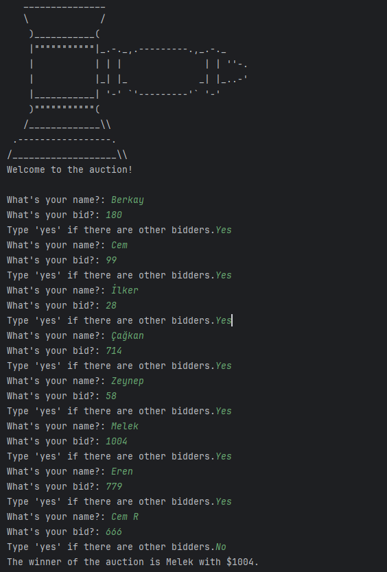
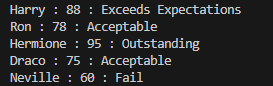

# Day 009

## Blind Auction
A program that simulates a blind auction where each participant enters their name and bid amount.  
Once there are no more bidders, the program determines the highest bidder and announces the winner.

This project mainly uses **dictionaries** to store bidder names and their corresponding bid amounts.  
Initially, I wrote a custom function with two global variables to track the maximum bid, but later 
I learned a much simpler and cleaner way to achieve this using Python’s built-in tools.

[Click Here To Run](https://www.programiz.com/online-compiler/3rXKZxH6S4vaU)

## Student Grader
Student Grades

This program converts student scores into grades using conditional statements.
A simple dictionary and conditional statement practice.

It takes a dictionary of student names and their scores, then outputs a new dictionary
 with grade categories such as Outstanding, Exceeds Expectations, Acceptable, or Fail.

 