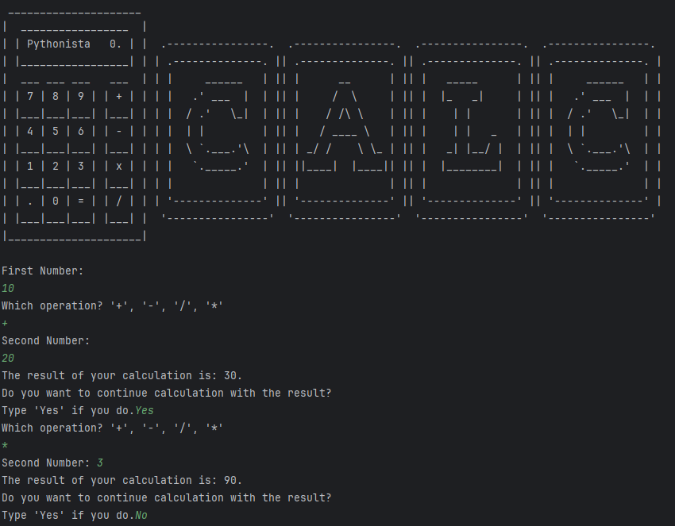
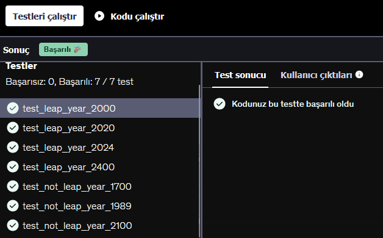

# Day 010

Here comes every developer's inevitable project: **T H E**  **C A L C U L A T O R**

## Calculator

A simple calculator that performs the four basic arithmetic operations: addition, subtraction, multiplication, and division.
Each operation is written as a separate function that returns the result, which was good practice for defining functions with parameters and using return values to keep the code reusable.

[Click Here to Run](https://www.programiz.com/online-compiler/9gyAP5O0IukLM)

## Leap Year Checker

A program that checks whether a given year is a leap year. It follows the standard rules: divisible by 4 means it may be a leap year, divisible by 100 means it is not, unless it is also divisible by 400.
This project was mainly an exercise in writing clean conditional statements and handling multiple logical branches.

