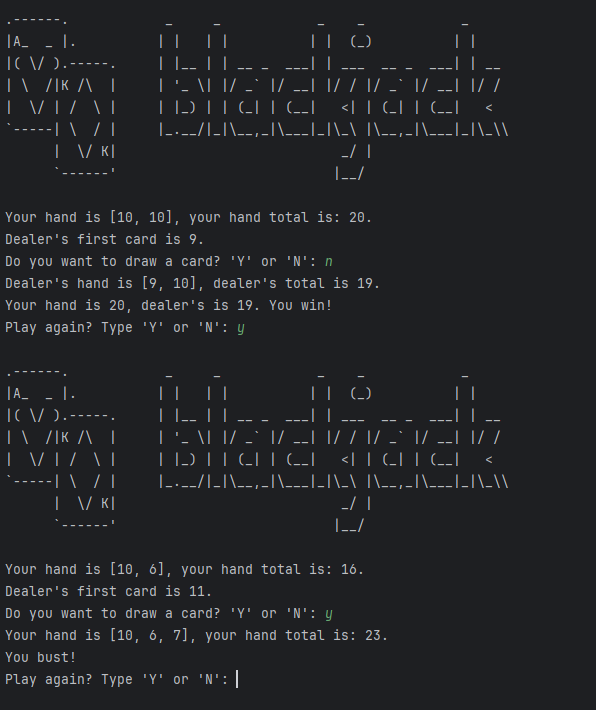

# Day 011
## Blackjack

This program simulates a simple game of Blackjack against the computer.
It uses lists to represent a deck of cards and functions to handle score calculation, card dealing, and game logic. The player can choose to draw more cards or pass, while the computer follows fixed rules to decide its moves. 

I realized that I can get lost in the loops and I am not at the stage where I can properly decide whether or not I should create a new function or just write a loop for the game logic.

[Click Here To Run](https://www.programiz.com/online-compiler/7QRZBuPUujDVV)

