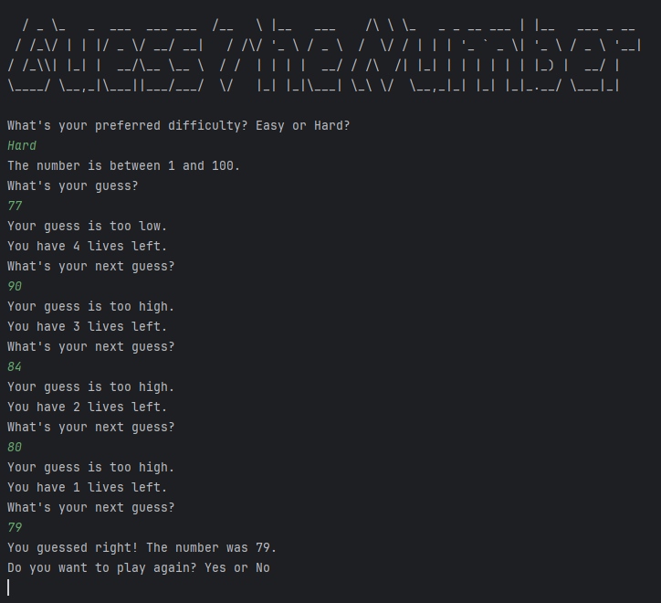

# Day 012

## Small Announcement

I decided not to include the smaller code exercises/projects in these day folders since the projects are getting bigger but the code exercises are not unless the side projects are actually difficult or interesting. 
## Number Guessing Game  

This program generates a random number between **1 and 100**.  
The player selects a difficulty level (*easy* or *hard*), which determines the number of attempts.  

The game provides feedback after each guess, telling the player if it’s **too high** or **too low**, until they either guess correctly or run out of attempts.  

[Click Here To Run](https://www.programiz.com/online-compiler/2POD9hcKVlE98)

