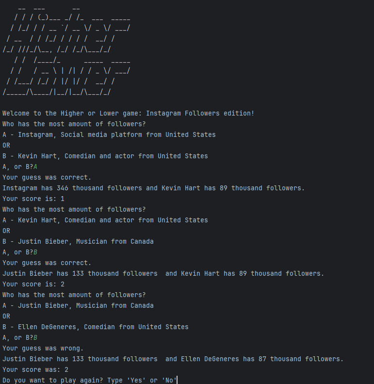

# Day 014

## Higher or Lower

This program is a guessing game where the player decides which celebrity has more Instagram followers.  
It mainly uses functions, dictionaries, and randomization to manage comparisons and keep score.

### Features
- Compare two random celebrities by Instagram followers  
- Keep score across rounds  
- Replay until wrong guess  

Projects use 2+ side imports from this point on, so click here to run is hard to execute.

