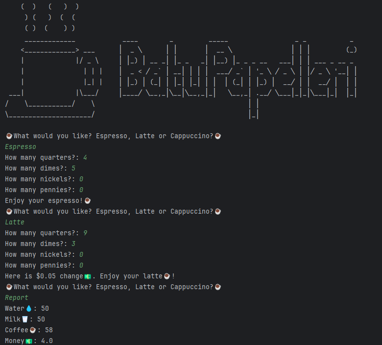

# Day 015

## Coffee Machine  
This program simulates a coffee machine. Users can choose drinks, pay with coins, and the machine checks resources before serving.  

### Features  
- Tracks available resources (water, milk, coffee, money)  
- Handles coin input and calculates change  
- Checks if resources are sufficient before making a drink  
- Supports shutting down the machine with `off` and printing a `report` of resources  

## Day 006 Exercise: Reeborg's Maze
As promised, managed to solve the infinite loop issue that I mentioned on Day 6 readme file. The solution turned out to be different from Ms. Yu's 
but still solved all three scenarios without a problem.

I basically made the code to run in 2 steps: Turn right if you can 3 times, then move.
This way turn right if you can never executed 4 times, thus avoiding the infinite loop.

#### This method solves the three scenarios with 232 steps less:
- problem_world in 68 steps as opposed to Ms. Yu's 245,
- problem_world2 in 474 steps as opposed to Ms. Yu's 313 and
- problem_world3 in 52 steps as opposed to Ms. Yu's 268

Obviously this is just luck, any three other scenarios might end up with my method requiring two thousand more steps but for these three, I win! 

*Gotta appreciate the small victories*