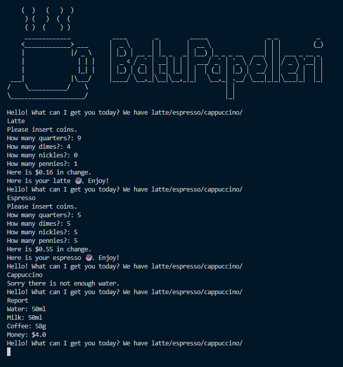
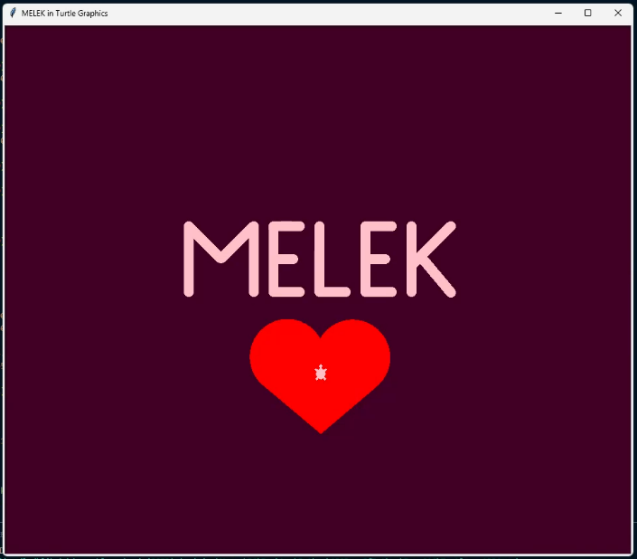

# Day 016

## Coffee Machine OOP

A refactored version of the coffee machine program using **Object-Oriented Programming (OOP)**.  
The project separates responsibilities into different classes such as `Menu`, `CoffeeMaker`, and `MoneyMachine` for cleaner and more modular code.

### Features
- `Menu` handles available drink options.  
- `CoffeeMaker` manages resources and brewing.  
- `MoneyMachine` deals with payments and transactions.  
- Structured code with better readability and scalability.  

## Turtle
Today was my first day of learning Turtle Graphics, so I played around with the speed, pen size, colours, etc. to write my girlfriend's name and to draw a heart. Created a curve function that uses a for loop for the smooth curve and created a heart() function that uses the curve function.

