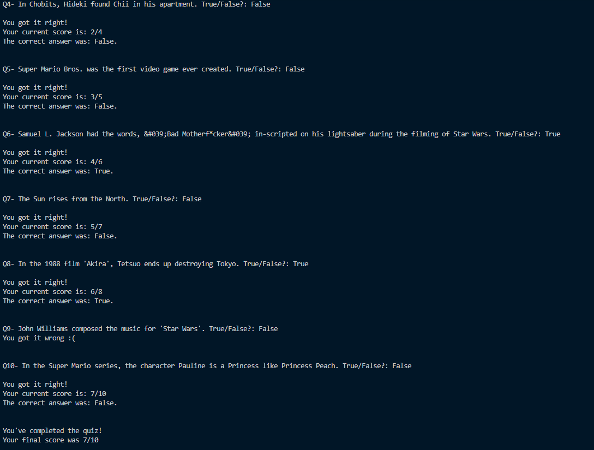

# Day 017

## Quiz Game

A simple quiz game built using **OOP principles**, where a `Question` class stores the text and answer, and a `QuizBrain` class handles the game logic. One can simply change the question list by getting a new set of questions in JSON format from the [Open Trivia Database](https://opentdb.com/) API.

If I come back to this project in the future, I'd like to automate the process of getting new API links from the OpenTDB and formatting the question data.  

### Features

- Object-oriented structure with clear separation of concerns.  
- Sequentially asks true/false questions.  
- Tracks current score throughout the game.  
- Provides feedback after each answer.  

#### Thoughts

Honestly, getting these concepts wrapped around my head was tougher than I thought. I keep thinking in simple procedural form, so a method of a class that interacts with another class object with different attributes was difficult to work with at the beginning. Practice makes perfect though!

Also, I decided to not rename main.py anymore, since OOP makes it possible for them to be standalone programs ~~as if it's not possible to write these with LLMs~~.

Quiz Game Screenshot:

