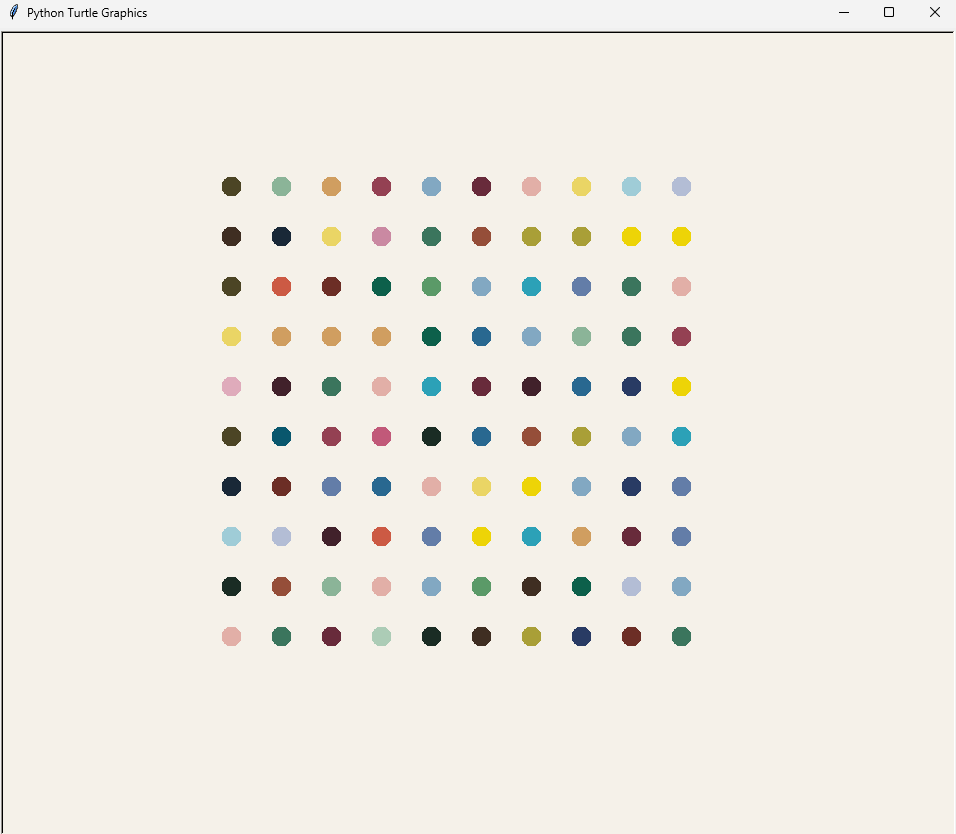

# Day 018

## Hirst Painting Project

A program that recreates Damien Hirst’s famous spot paintings using the Turtle graphics module.  
It places colored dots in a grid using random colors from a predefined palette.

### Features

- Generates a 10x10 grid of colored dots  
- Uses a custom RGB color palette extracted from a piece from the artist.
- Implements efficient drawing with `teleport` and hidden turtle for speed  

---

## Turtle Exercises

Additional Turtle graphics practice programs, not full projects but useful exercises.  

### Features

- Dashed line drawing  
- Polygons with random colors  
- Random walk with changing colors and directions  
- Circular spirograph-like patterns 

#### Thoughts

Well when I was playing with the Turtle to write my girlfriends name, I got familiar with a lot of Turtle's methods such as goto, pen up, pen down, pen size or speed so this wasn't that difficult, as I basically wrote regular functions and loops with methods I already know.