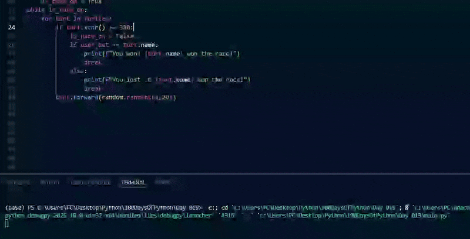

# Day 019

## Turtle Race Project

A fun racing game built with the Turtle graphics module.  
User places a bet on which turtle will win before the race starts.

### Features

- Seven turtles with different colors line up at the starting line  
- User can input a bet on the winning turtle(They are my friends' names.)
- Turtles move forward with random speeds, making each race unique  
- Displays the winner and compares it to the user’s bet  

## Etch-a-Sketch

Etches a sketch with arrow keys:

- Up Arrow for forward
- Down Arrow for backward
- Right Arrow for right turns
- Left Arrow for left turns
- "C" key for clearing the screen

### Features

- Etches a sketch