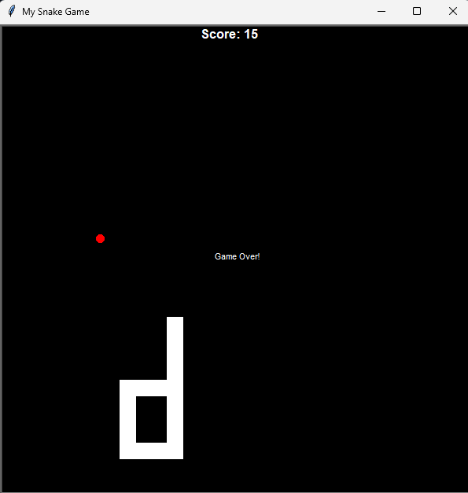

# Day 020 & 021

## Snake Game

Recreation of the classic **Snake game** using Turtle graphics and OOP.  
These two days cover building the snake, adding movement, and introducing gameplay mechanics.

### Features

- Snake built from multiple segments  
- Smooth movement with update cycles  
- User control with arrow keys (Up, Down, Left, Right)  
- Food spawns at random locations  
- Snake grows longer when eating food  
- Score tracking and display  
- Collision detection with walls and snake’s own body  

