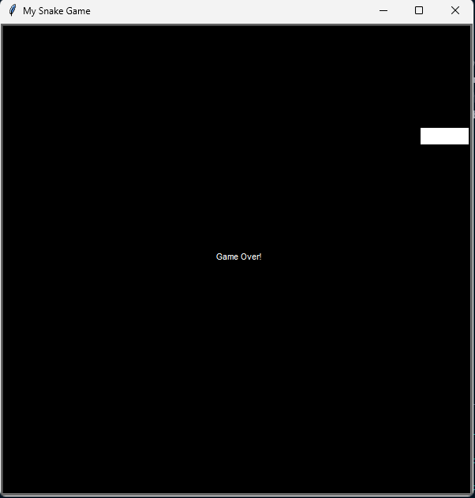

# Day 20 & 21

## Snake

Guide a growing snake to collect food while avoiding walls and yourself. Classic arcade gameplay rebuilt from scratch.

Two days focused on object coordination, movement systems, and game mechanics.

### Features

- Smooth segment-based snake movement
- Arrow key controls with 180-degree turn prevention
- Random food spawning with growth mechanics
- Progressive speed increase with score
- Precise wall and self-collision detection

### Technical Implementation

**Segment Coordination:** Each body part follows the previous segment's position for fluid movement.

**Input Safety:** Direction logic prevents 180-degree instant-collision turns.

**Collision Systems:** Boundary checks with size-adjusted margins and efficient segment distance calculation.

**Performance Optimization:** Screen tracer controls eliminate flickering during multi-segment updates.

