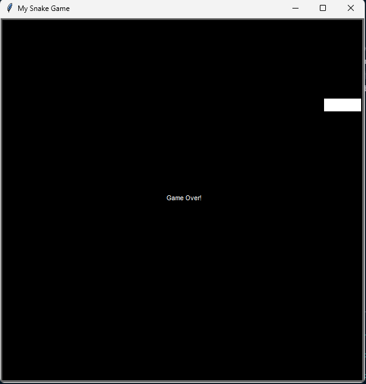

# Day 020

## Snake Game: Part 1

The first step in recreating the classic **Snake game** using Turtle graphics and OOP.  
The project focuses on building the snake and controlling its movement.

### Features  

- Snake built from multiple segments  
- Smooth forward movement using update cycles  
- User control with arrow keys (Up, Down, Left, Right)  
- Added a Game Over clause on borders

