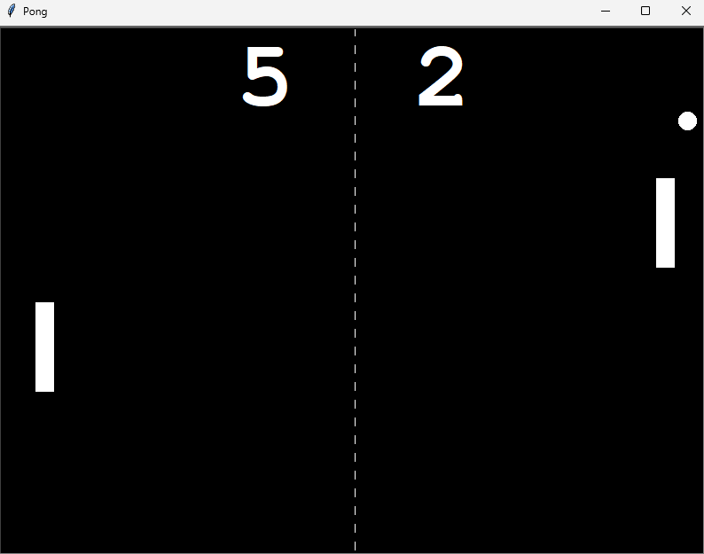

# Day 022

## Pong Game

A recreation of the classic **Pong** arcade game built using the `Turtle` module.  
This project introduces multiple class interactions, movement handling, and collision detection.

### Features

- Two-player gameplay using **W/S** and **Up/Down** keys  
- Realistic ball speed and bounce behavior  
- Score tracking for both players  
- Automatic ball reset after scoring  
- Modular code structure with separate classes for paddles, ball, and scoreboard

