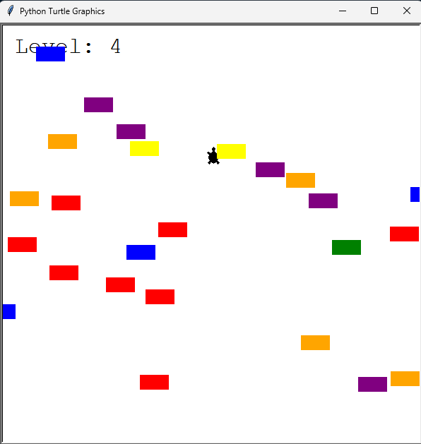

# Day 23

## Turtle Crossing

Guide a turtle across a busy road while avoiding moving cars. Each successful crossing increases the difficulty, testing both player skill and code robustness.

A capstone project that combines all skills I learned so far to create a complete game experience.

### Features

- Player-controlled turtle with smooth movement
- Randomly generated cars with progressive speed increases  
- Real-time collision detection and level progression
- Score tracking and visual feedback system

### Technical Implementation

**Object-Oriented Architecture:** Separate Player, CarManager, and Scoreboard classes with clear responsibilities.

**Memory Management:** Automatic cleanup of off-screen cars preventing performance issues.

**Collision System:** Calibrated hitbox detection accounting for turtle graphics quirks.

**Dynamic Difficulty:** Frame-rate based speed scaling for smooth progressive challenge.

