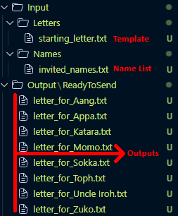

# Day 24

## Mail Merge

Automate personalized letter generation by merging names from a list into template letters. Perfect for invitations, newsletters, or bulk communications.

A practical file I/O project focusing on string manipulation and automated document processing.

### Features

- Batch processing of multiple recipient names
- Template-based letter generation with placeholder replacement
- Organized file structure with separate input/output directories
- Dynamic file naming for easy tracking
- Support for custom templates and name lists

### Technical Implementation

**File I/O Management:** Simultaneous handling of multiple file operations with proper context managers.

**String Template System:** Placeholder replacement using Python's built-in string methods for efficient text manipulation.

**Batch Processing Pipeline:** Automated workflow from name list reading to individual file generation.

**Dynamic File Creation:** Programmatic file naming and organization in dedicated output directories.

