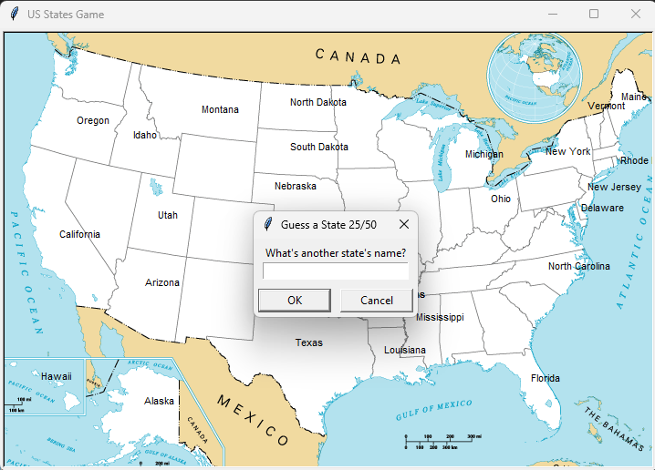

# Day 25

## US States Game

Test your geography knowledge by naming all 50 US states. The game displays your progress and helps you learn the states you missed.

An educational game that combines data processing with interactive turtle graphics.

### Features

- Interactive map with state coordinate positioning(They are very off-center :((  )
- Real-time progress tracking (X/50 states)
- Exit option that generates a study guide of missed states
- Case-insensitive input handling
- Prevention of duplicate answers

### Technical Implementation

**Coordinate-Based Mapping:** Used x,y coordinates from CSV data to place state names on the bitmap image.

**Dynamic Progress Tracking:** Real-time counter updates using list length instead of separate counter variables.

**Study Guide Generation:** Automatic CSV export of missing states using list comprehension filtering.

**Input Validation:** Case normalization and duplicate prevention for clean gameplay experience.

