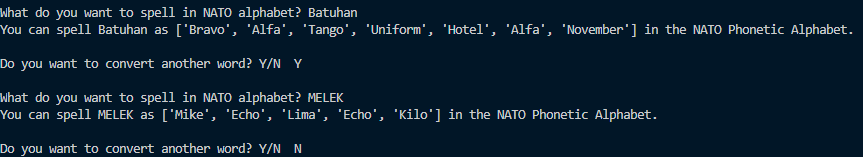

# Day 26

## NATO Phonetic Alphabet

A simple practice project converting words to NATO phonetic codes using dictionary lookup.

### Features

- Converts any word to NATO phonetic spelling
- Case-insensitive input handling

### Technical Notes

**Dictionary Comprehension:** Built NATO code lookup from CSV data using efficient dictionary creation.

**List Processing:** Combined input sanitization with phonetic code lookup in a streamlined data pipeline.

