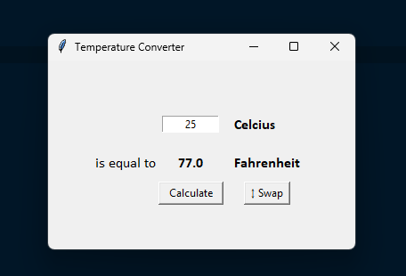

# Day 27

## Temperature Converter

A GUI application that converts between Celsius and Fahrenheit with dynamic direction swapping and input validation.

A practical introduction to Tkinter GUI development and user interface design.

### Features

- Bidirectional temperature conversion (Celsius ↔ Fahrenheit)
- Dynamic UI labels that update based on conversion direction
- Input validation with user-friendly error messages
- Clean, responsive interface with proper spacing

### Technical Implementation

**Dynamic UI Management:** Real-time label updates and state tracking for conversion direction swapping.

**Input Validation:** Comprehensive error handling for empty inputs and non-numeric values with humorous feedback.

**Layout Management:** Grid-based widget positioning with consistent padding and alignment.

**State Management:** Global variable tracking for conversion direction with coordinated UI updates.

