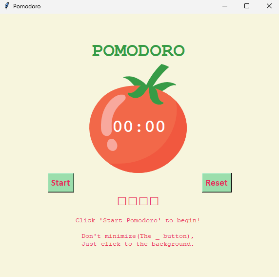

# Day 28

## Pomodoro Timer

A productivity-focused timer application implementing the Pomodoro Technique with visual progress tracking and session management.

A comprehensive GUI project combining timing logic, state management, and user experience design.

### Features

- 25-minute work sessions with 5-minute short breaks
- 30-minute long break after 4 work sessions
- Visual progress tracking with session checkmarks
- Auto-advancing timer cycles
- Window focus management for productivity
- Full reset functionality

### Technical Implementation

**Session State Management:** Complex rep counting logic coordinating work/break cycles and long break scheduling.

**Visual Feedback System:** Dynamic label updates and progress checkmarks using Unicode symbols and color coding.

**Countdown Mechanism:** Recursive timing logic with formatted display and auto-advance to next session.

**UI Layout Design:** Grid-based widget positioning with custom colors and consistent visual hierarchy.

