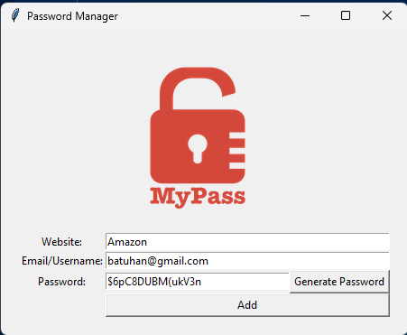

# Day 29 & 30

## Password Manager

A secure desktop application for generating and storing passwords with automatic clipboard integration and data validation.

A practical security tool combining password generation, file management, and user experience design.

### Features added in Day 29

- Strong password generation with letters, numbers, and symbols
- Automatic clipboard copying for immediate use
- Data validation to prevent empty field submissions
- Confirmation dialogs before saving sensitive information
- Persistent storage in organized text file format

### Features added in Day 30

- Added Search button to find saved passwords
- JSON file storage instead of text file
- Error handling for missing data file
- Improved data structure for better organization

### Technical Implementation

**Password Generation Engine:** Custom algorithm with controlled character distribution and secure randomization.

**Data Storage:** JSON file system with dictionary merging to preserve existing entries.

**Search Function:** File exception handling and nested dictionary lookups.

**Clipboard Integration:** Automatic password copying using pyperclip for seamless user workflow.

