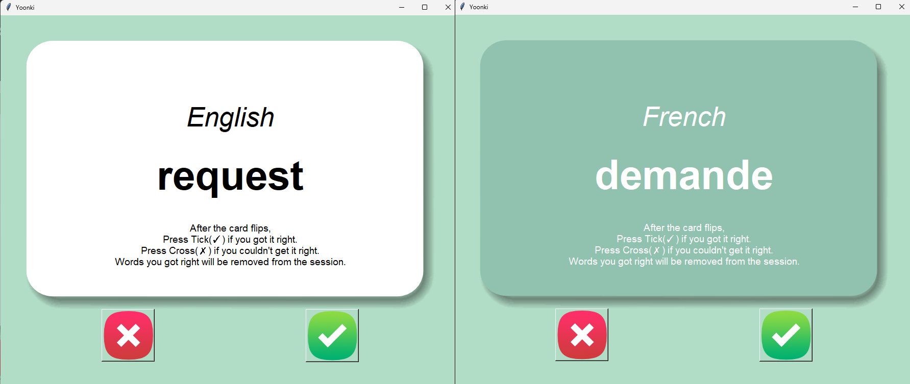

# Day 31

## Yoonki - Flashcard App

An intelligent flashcard application for language learning with spaced repetition and session-based progress tracking.

A sophisticated memory training tool that adapts to your learning pace and focuses on challenging vocabulary.

### Features

- Automatic card flipping with timed translation reveal
- Session-based word tracking that removes mastered terms
- Dynamic session restart when all words are completed
- Clean, intuitive interface with visual feedback
- Progress-based word prioritization

### Technical Implementation

**Session Management:** Intelligent word tracking that removes mastered terms while maintaining session progress.

**Timer Coordination:** Cancellable flip timers that reset with each new card for precise timing control.

**Dynamic UI States:** Seamless transitions between start screen, active session, and completion states.

**Data Structure Optimization:** Dictionary-based word storage with efficient random access and list manipulation.

