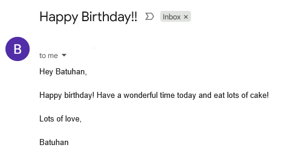

# Day 32

## Automated Birthday Wisher

An automated email system that sends personalized birthday greetings on the correct date using template-based messages.

A practical automation project combining scheduling, email integration, and personalized content generation.

### Features

- Automatic date detection and birthday matching
- Randomized template selection for varied greetings
- Name insertion in email content
- SMTP email integration with proper formatting
- CSV-based contact and birthday management

### Technical Implementation

**Date Automation:** Real-time system date checking against stored birthdays for automatic triggering.

**Template System:** Dynamic letter selection with placeholder replacement for personalized messages.

**Email Integration:** SMTP protocol implementation with TLS security for reliable message delivery.

**Data Pipeline:** CSV processing with row iteration and conditional date matching logic.

### Setup

1. Replace email credentials in `main.py` with your Gmail and App Password
2. Add contact birthdays to `birthdays.csv`
3. Customize letter templates in `letter_templates/` folder

