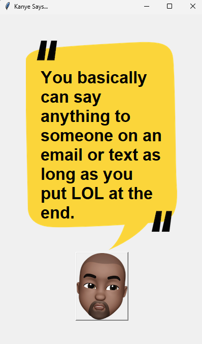

# Day 33

## ISS Location Notifier

A demonstration of real-time API integration that tracks the International Space Station's position and would send email alerts when visible in your area.

A technical showcase of multi-API coordination and conditional notification systems.

### Features

- Real-time ISS position tracking via Open Notify API
- Sunset/sunrise calculation using Sunrise-Sunset API  
- Conditional email notification logic
- Configurable location and timing parameters
- Timezone-aware sunset calculations

### Technical Implementation

**Dual API Integration:** Coordinated data fetching from multiple APIs with error handling.

**Geospatial Logic:** Degree-based proximity checking with configurable tolerance offsets.

**Time Zone Management:** UTC conversion and offset handling for accurate timing.

**Modular Design:** Separated ISS tracking, sunset calculation, and notification logic.

*Note: This is a technical demonstration - the system logic is fully functional but requires scheduling for continuous operation*

---

## Kanye Quotes App

A lightweight desktop application that displays random Kanye West quotes via API so everyone can get their Kanye Wisdom(!) daily.

**Features:** Real-time quote generation, themed GUI, one-click refresh

