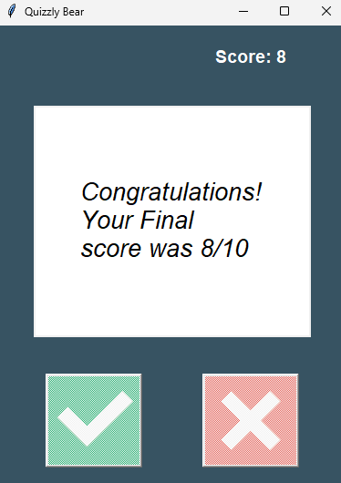

# Day 34

## Quizzly Bear - Trivia Quiz App

An interactive True/False quiz game that fetches questions from the Open Trivia Database API with real-time scoring and visual feedback.

A comprehensive GUI application demonstrating API integration, object-oriented design, and user interface development.

### Features

- Dynamic question fetching from Open Trivia DB API
- Real-time scoring with visual feedback
- HTML entity decoding for proper text display
- Responsive True/False button interface
- Progressive difficulty and session management

### Technical Implementation

**API Integration Layer:** Separate data class handling API requests and response parsing with error handling.

**MVC Architecture:** Clean separation between data models, quiz logic, and user interface components.

**Visual Feedback System:** Color-coded responses (green/red) with timed reset for immediate user feedback.

**HTML Entity Handling:** Proper decoding of API responses to display special characters correctly.

