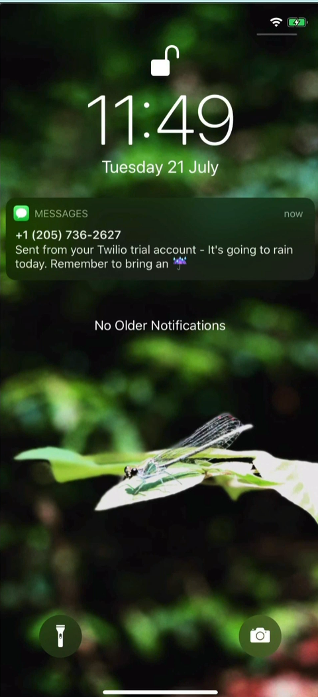

# Day 35

## Rain Alert System

An automated weather monitoring system that checks precipitation forecasts and sends SMS alerts when rain is expected.

A practical automation project combining weather API integration with SMS notifications for daily planning.

### Features

- 12-hour weather forecast analysis using OpenWeatherMap API
- Automatic rain detection based on weather condition codes
- SMS alert system via Twilio integration
- Configurable location parameters
- Lightweight, scheduled execution

### Technical Implementation

**Weather API Integration:** Multi-hour forecast parsing with condition code analysis for precipitation detection.

**SMS Gateway:** Twilio API integration for reliable message delivery with status tracking.

**Condition Logic:** Weather code interpretation (codes <700 indicate precipitation) for accurate alert triggering.

**Environment Configuration:** Secure credential management for API keys and service authentication.

