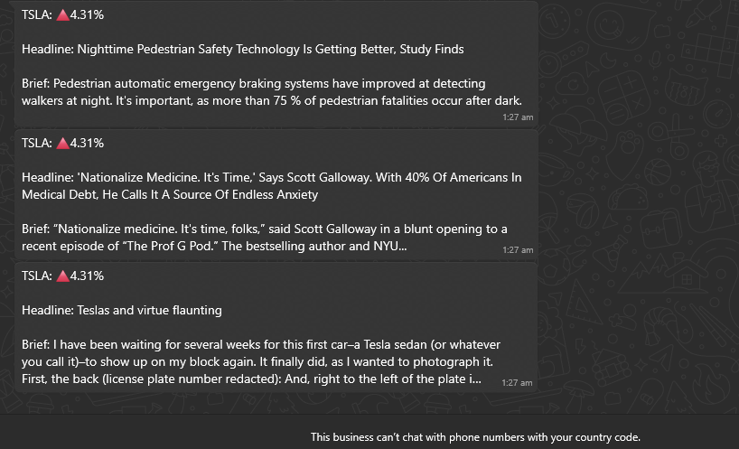

# Day 36

## Stock News Alert System

An automated monitoring system that tracks significant stock price movements and delivers relevant news alerts via WhatsApp.

A sophisticated multi-API integration project combining financial data analysis with real-time news delivery.

### Features

- Daily stock price monitoring with percentage change calculation
- Automated news fetching for significant price movements  
- WhatsApp message delivery for instant mobile notifications
- Configurable price threshold for alert sensitivity
- Secure environment variable management

### Technical Implementation

**Dual API Integration:** Coordinated data fetching from Alpha Vantage (stock data) and NewsAPI (news articles).

**Financial Analysis:** Daily price comparison with percentage change calculation and directional indicators.

**Conditional Workflow:** Threshold-based triggering system that only fetches news during significant market movements.

**Secure Configuration:** Environment variable management for API keys and sensitive credentials.

*Note: The core alert logic is fully functional - requires external scheduling (e.g., cron job, cloud function) for daily automated execution.*

