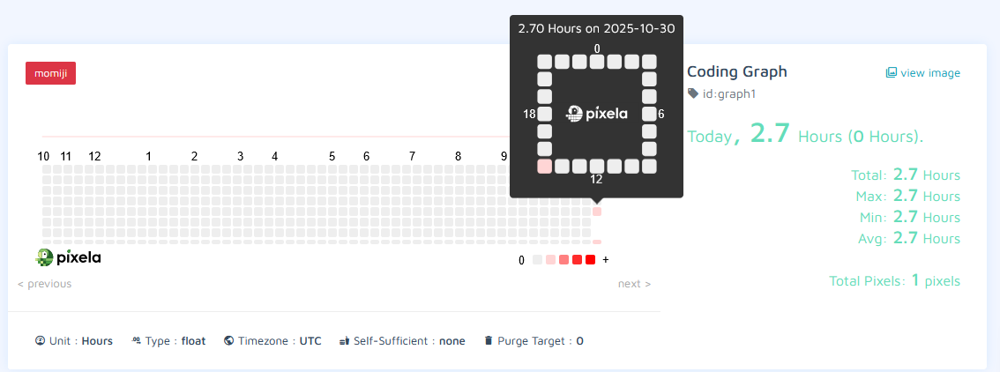

# Day 37

## Habit Tracker with Pixela

A personal coding habit tracker that logs daily programming hours to a customizable online graph using the Pixela API.

A practical API integration project for building consistent development habits with visual progress tracking.

### Features

- Daily coding hour logging with user input
- Interactive graph creation and management
- Pixel modification and deletion capabilities
- Timezone-aware date handling
- Secure credential management

### Technical Implementation

**REST API Integration:** Full CRUD operations (Create, Read, Update, Delete) with Pixela's habit tracking API.

**Dynamic Date Handling:** Automated date formatting and timezone management for accurate daily tracking.

**User Input Flow:** Interactive console-based input for daily progress logging.

**Authentication System:** Secure token-based authentication with proper header management.

### Setup

Create a `.env` file with your Pixela credentials:

- USERNAME=your_pixela_username
- TOKEN=your_pixela_token

